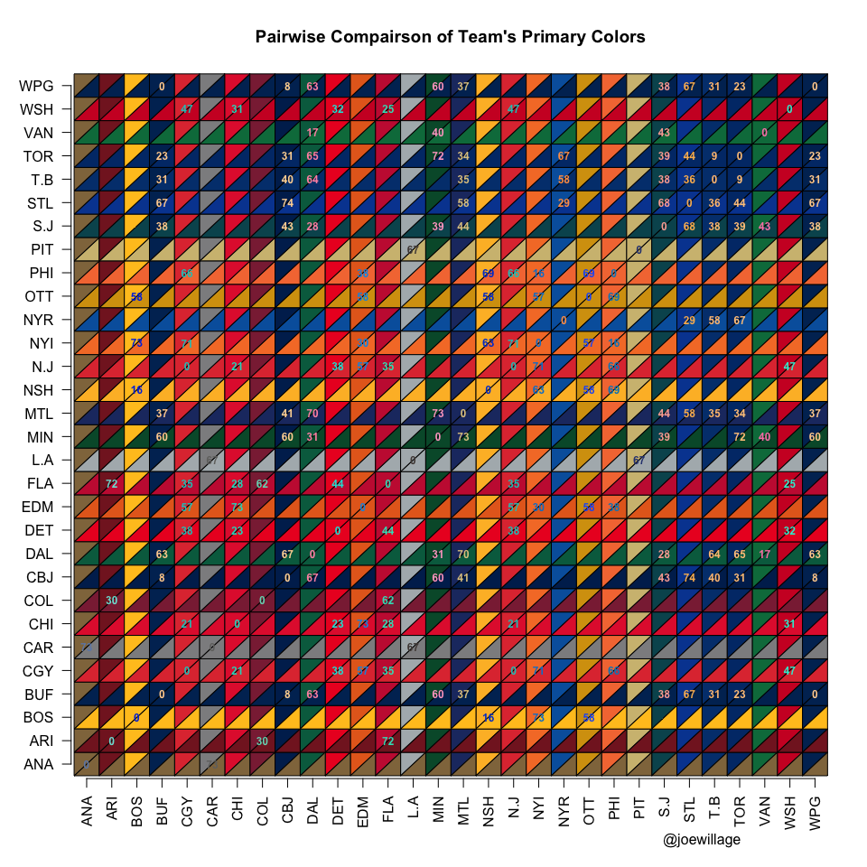

# Color Comparison
Joe Willage  
March 1, 2016  


```r
suppressWarnings(suppressPackageStartupMessages(source("hockey/eventPlot.R")))

colorInv <- function(x) {
  # Finds the inverse of a color
  #
  # Args:
  #   x:  RGB hex color
  #
  # Returns:
  #  Inverse hexadecimal character representation of the input string
  #
  
  inv <- as.hexmode(255 - col2rgb(x))
  paste0("#", paste0(inv, collapse = ""))
}

plot(c(1, 29), c(1, 29), type = "n", xlab = "", ylab = "",axes = FALSE,
     main = "Pairwise Compairson of Team's Primary Colors")
axis(1, at = seq(0.5, 29.5, by = 1), labels = names(team.colors[1:30]), las = 2)
axis(2, at = seq(0.5, 29.5, by = 1), labels = names(team.colors[1:30]), las = 2)

for (i in 1:30){
  for (j in 1:30){
    polygon(c(i, i - 1, i - 1, i), c(j, j, j - 1, j), col = team.colors[j], border = NA)
    polygon(c(j - 1, j, j, j - 1), c(i - 1, i - 1, i, i - 1), col = team.colors[j], border = NA)
  }
}

for (i in 1:30){
  for (j in 1:30){
    diff <- colorDiff(team.colors[i], team.colors[j])
    if (diff < 75){
      text(i - 0.5, j - 0.5, labels = as.character(round(diff)), cex = 0.75, 
           col = colorInv(team.colors[i]), font = 2)
    }
  }
}

mtext("@lustyandlewd", 1, at = 25, padj = 5)
```

 
