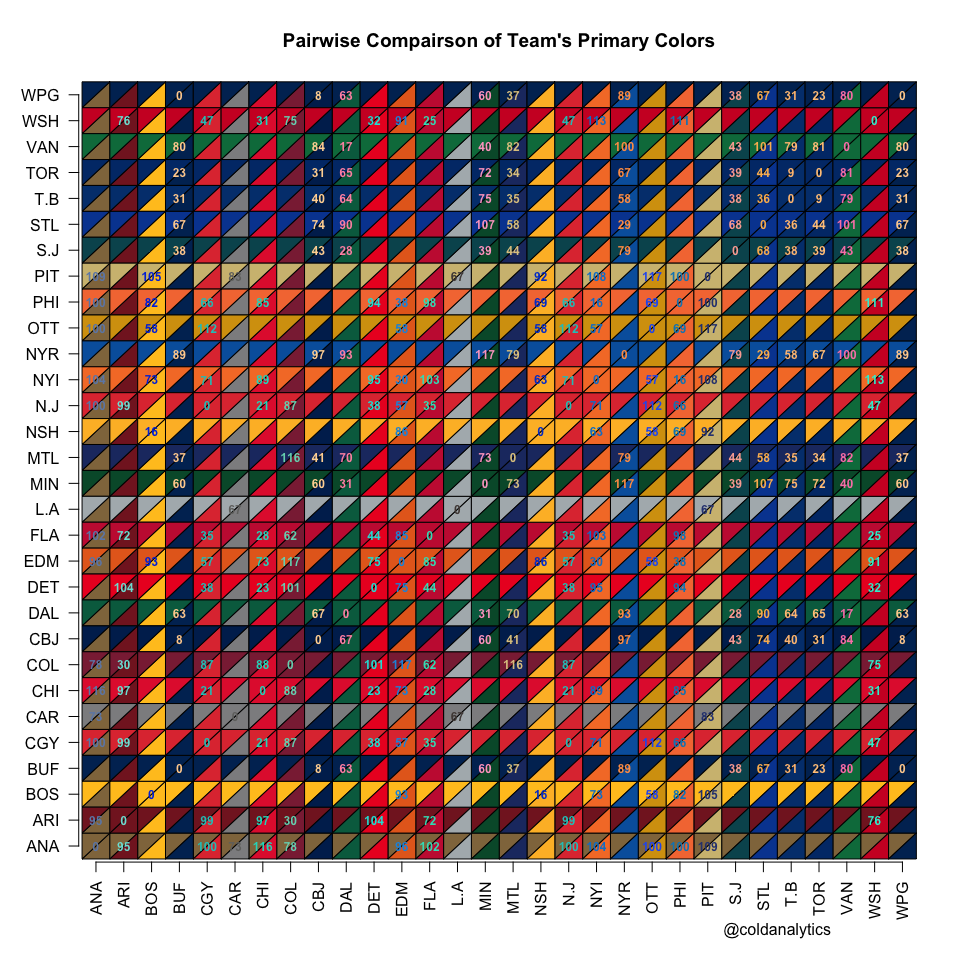

# Color Comparison
Joe Willage  
December 7, 2016  

Before discussing the main topic of graph colors, a little background. All of the site's visualizations are of course generated programmatically[^1]. That is, the same code can be run with different data, and produce a chart that's ready to publish with no additional modification. Unlike a general purpose graphing utility, the tools that produce the viz for the site consume a strict set of data[^2]: there's a finite set of team names/nicknames/cities; there's an expected range for events like Corsi and faceoff wins; there's a predetermined primary and secondary color for each team. These facts mean that we don't have to allow for too much slack in the handful of charts that are produced for Cold Analytics. That's good because it means that charts will have the same look and feel regardless of the day of the game, or the teams that play, or the amount of shots that are taken, for instance.  

One area where human judgement would be a marked improvement over automation is color selection. There's a large body of knowledge that exists on color science and theory. Much [research](https://research.tableau.com/paper/affective-colour-palettes-visualization-poster) has been done to inform the types of colors and color properties that are best suited for [visual displays of quantitative information](https://www.edwardtufte.com/tufte/books_vdqi). However, there are very few hard-and-fast rules in the world of data visualization. Most *rules* are highly dependent on the context, and the data viz for Cold Analytics are no different. If we followed the guidelines strictly, every chart would have the same two colors for home and away. Those colors would be something like orange and blue, which work well together because they're complementary, making them easily distinguishable. They're also discernible for people with [color vision deficiency](http://www.tableau.com/about/blog/2016/4/examining-data-viz-rules-dont-use-red-green-together-53463) (color blindness). I use **R** to create all of Cold Analytic's charts, specifically the [ggplot2](http://ggplot2.tidyverse.org/) package. ggplot does an excellent job by providing orange and blue for its default colors (well...salmon and cyan). This is what a Corsi chart would look like with default colors.  

<!-- -->

While this chart is clear and interpretable, we instead use each team's primary or secondary colors. This facilitates the more natural association we have with team's colors. The Wings are red, the Leafs are blue, the Stars are green, etc. We lose a bit of the accessibility by not adhering to a stricter coloring system, but we gain a more intuitive chart. Team colors appear how we *expect* them to appear, and that's a huge part of data visualization. So instead, the charts look like this:  

<!-- -->

The Cold Analytics charts attempt to first use each team's primary color. The problem with this is many teams have the same or similar primary colors (8 teams use shades of red). To solve this issue, we introduce the team's secondary color. This allows us to display both team's primary colors when possible, and when the colors are too similar, we use the away team's secondary color.  

Color similarity is determined by the [Euclidean distance](https://en.wikipedia.org/wiki/Color_difference) between two RGB colors. Each team's primary  hex code is broken down into its red, green, and blue components For instance, the St. Louis Blues have a primary color of #0546A0. This gets broken down into red:5, green:70, blue:160. This decomposition occurs for the home and away team, resulting in two R, G, and B values. Then each away component is subtracted from its respective home component. The three differences are squared and added together.

$(Red_{ home} - Red_{away})^2 + (Green_{ home} - Green_{away})^2 + (Blue_{ home} - Blue_{away})^2)^{1/2}$

In this way, if red, green, and blue each have large differences, the result will be a large number. If there is a large difference in the red and green components, maybe it's offset by very similar blue components. The result is an integer that can be used as a proxy for color similarity. The smaller than number, the more similar the two colors. Values above 75 tend to mean that the colors can be distinguished relatively easily with the human eye (with my human eyes at least). This was the threshold used to determine if the away team would get to use its primary color in the chart, or its secondary color. However, "distinguishable by the human eye" still doesn't necessarily make for a good chart. Take for instance this Senators vs Penguins game. The color difference is 117. You can distinguish the lines on the graph if your only task is to separate the lines. But this becomes more difficult as you also try to interpret the meaning of the graph, taking into account the penalty spans and the dotted lines for goals.  

<!-- -->

To make these charts easier to read, games with color differences smaller than 118 utilize the away team's secondary color. Now the same chart from the OTT / PIT game looks like this.

<!-- -->

Below is a comparison of each team's primary colors. Matchups with differences less than 118 are annotated.  

<!-- -->

[^1]: One-off posts and blogs, are the exception. All of the tools that generate images for daily games are automated. &nbsp;&nbsp;

[^2]: As long as nhl.com doesn't screw up too bad &nbsp;&nbsp;
